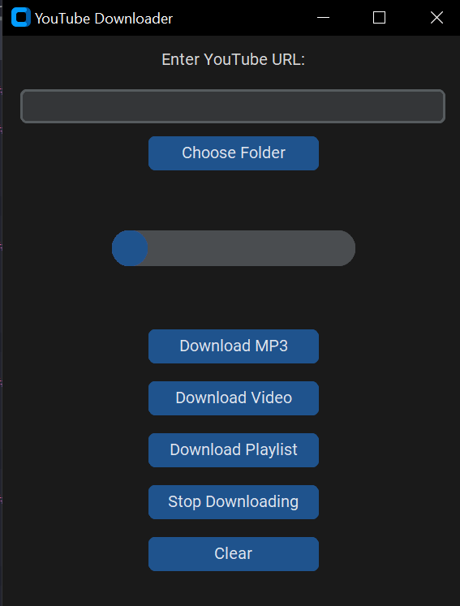
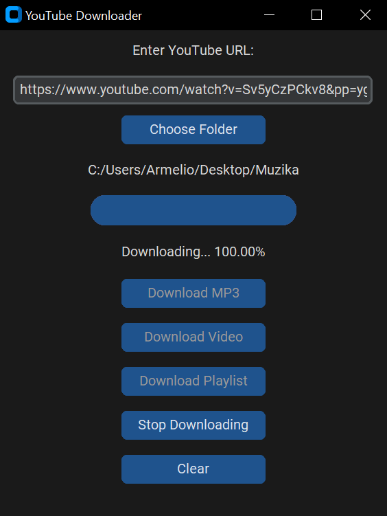
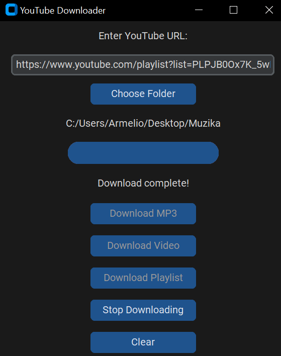
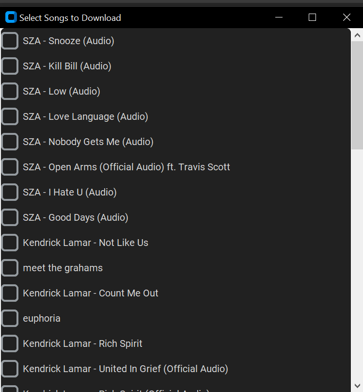
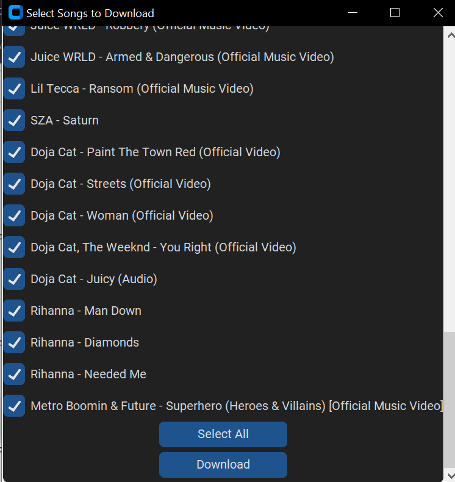
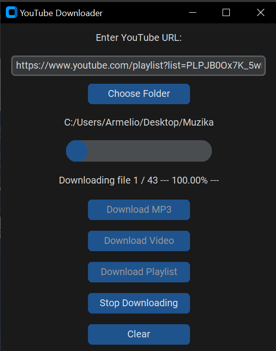
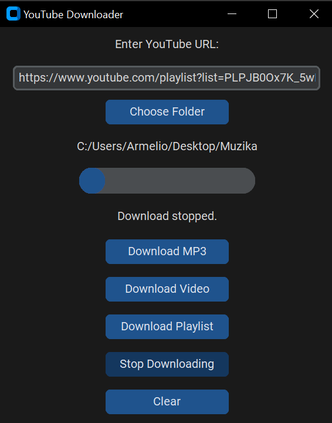
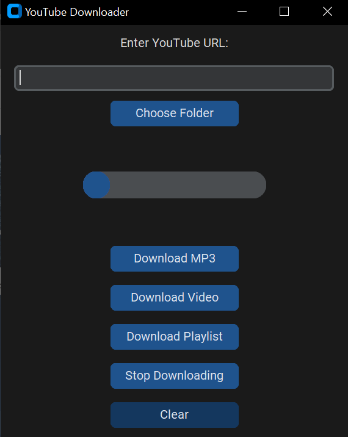

# YT-downloader

**YT-downloader** is a Python application for downloading audio and video content from YouTube. It supports downloading
single audio files, multiple audio tracks, and entire playlists, all with a user-friendly interface.

## Table of Contents

- [Features](#features)
- [Installation](#installation)
- [Usage](#usage)
- [Configuration](#configuration)
- [Dependencies](#dependencies)
- [Contributing](#contributing)
## Features

- **Download audio and video content from YouTube:** Easily download single audio tracks or videos in various formats (e.g., MP3, MP4) directly from YouTube.

- **Support for downloading entire playlists:** Download all videos in a playlist with a single command, saving you time and effort.

- **Fetch video titles:** Automatically retrieve and save the titles of downloaded videos alongside their files for easy identification.

- **Progress tracking:** Monitor the download progress in real-time with visual feedback, so you know how much of a file has been downloaded.

- **Customizable output directory:** Specify the folder where you want to save downloaded files, making organization easier.

- **Error handling:** Robust error handling to manage issues like broken links or network interruptions, ensuring your downloads proceed smoothly.

- **User-friendly CLI:** A command-line interface that is intuitive and easy to navigate, allowing users to perform downloads with minimal setup.

- **Cross-platform compatibility:** Works on Windows, macOS, and Linux, allowing users from different operating systems to use the tool without issues.

- **Option for downloading subtitles:** Ability to download subtitles for videos, providing a complete viewing experience.

- **Lightweight and efficient:** Optimized to use minimal system resources while downloading, ensuring other applications can run smoothly.


## Installation

1. **Clone the repository:**
   ```bash
   git clone https://github.com/your-username/YT-downloader.git
   cd YT-downloader
2. **Set up a virtual environment:**
   ```bash
    python -m venv .venv
    source .venv/bin/activate  # On Windows use .venv\Scripts\activate
3. **Install dependencies:**
   ```bash
   pip install -r requirements.txt

## Usage

### Launching the Application:

- Open the application by running the main Python script or the executable file (depending on how you've set it up). This will launch the graphical user interface (GUI).



### Choose folder :

- Click the Choose Folder button to select the destination folder where the downloaded files (audio or video) will be saved.
- Once the folder is selected, all files will be saved in the chosen location..


### Single Audio Download:

- Enter a YouTube link in the input field for downloading a single audio file and click on the "Download MP3" button.
- The downloaded audio file will be saved in the selected folder.



### Video Download:

- Enter a YouTube link in the input field for downloading a video file and click on the "Download Video" button.
- The downloaded video file will be saved in the selected folder.



### Playlist Download:

- To download an entire playlist, enter the playlist URL into the input field and click the "Download" button.
- The application will open a Selenium browser window to fetch all the video URLs from the playlist.
- Once all the URLs are fetched, a new window will appear showing the list of songs in the playlist.



- The user can then select which songs they want to download from the list.



- After selecting the songs, click the Download button to start downloading the chosen tracks.



### Stopping a Download:

- During a download, if you need to stop it, click the "Stop" button. This works for all download options (audio, video, and playlist).




### Clear all fields:

- To reset the interface and clear all input fields (such as YouTube URLs or selected playlist items), click the Clear button. This will remove all entries from the fields and restore the default state of the application.




## Configuration
- Make sure to edit any necessary settings in the configuration files located in the drivers directory.
- Modify paths or any required parameters in the scripts according to your needs.
## Dependencies
- Python 3.x
- chromedriver.exe (used by selenium to fetch all playlist links)
- ffmpeg.exe (for downloading videos and audios in specified format)
- Other libraries specified in requirements.txt


## Contributing

Contributions are welcome! To contribute to this project, please follow these steps:

1. **Fork the repository**  
   Click on the "Fork" button at the top right of the repository page to create your copy of the repository.


2. **Clone your fork**  
   Open your terminal and run:
   ```bash
   git clone https://github.com/Armelionofulla/YT-downloader.git
   cd YT-downloader

3. **Create a new branch**

   Create a new branch for your feature or bug fix:
   ```bash
   git checkout -b feature-branch
4. **Make your changes**

   Implement your changes and add any new features.


5. **Commit your changes**

   Save your changes and commit them with a descriptive message:
   ```bash
   git commit -m 'Add new feature'
   
6. **Push to the branch** 
   
   Upload your changes to your fork:
   ```bash
   git push origin feature-branch

7. **Create a new Pull Request**
   
   Go to the original repository and click on "New Pull Request." Select your branch and submit the request.

Thank you for your contributions! Your efforts help make this project better for everyone.